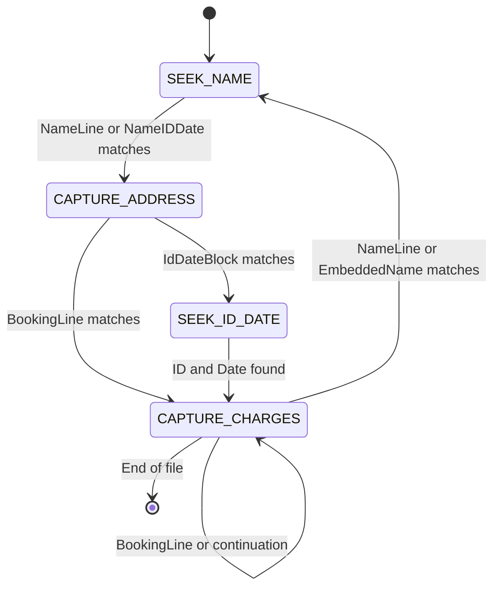

# Parsing State Machine and Regex Patterns

## Overview

The parsing state machine is responsible for converting preprocessed text lines into structured `Record` objects. It implements a finite state machine that transitions between states based on pattern matching and context.



## States

1. **SEEK_NAME**: Looking for a name line to start a new record
2. **CAPTURE_ADDRESS**: Collecting address lines until ID/Date or Booking line
3. **SEEK_ID_DATE**: Looking for ID and Date information
4. **CAPTURE_CHARGES**: Collecting booking charges until a new name is found

## Enhanced Regex Patterns

The parser now uses enhanced regex patterns to identify different components of the text, including embedded names:

```python
# Name line (strict, all caps)
NAME_REGEX_STRICT = re.compile(r"^(?P<last>[A-Z][A-Z\-\.' ]+),\s+(?P<firstmid>[A-Z][A-Z\-\.' ]+)$")

# Name line (tolerant, mixed case)
NAME_REGEX_TOLERANT = re.compile(r"^(?P<last>[A-Za-z][A-Za-z\-\.' ]+),\s+(?P<firstmid>[A-Za-z][A-Za-z\-\.' ]+)$")

# Embedded name patterns (anywhere in line)
NAME_REGEX_EMBEDDED_STRICT = re.compile(r"(?P<last>[A-Z][A-Z\-\.' ]+),\s+(?P<firstmid>[A-Z][A-Z\-\.' ]+)")
NAME_REGEX_EMBEDDED_TOLERANT = re.compile(r"(?P<last>[A-Za-z][A-Za-z\-\.' ]+),\s+(?P<firstmid>[A-Za-z][A-Za-z\-\.' ]+)")

# Name with ID and date on same line
NAME_ID_DATE_REGEX = re.compile(r"^(?P<name>(?P<last>[A-Z][A-Z\-\.' ]+),\s+(?P<firstmid>[A-Z][A-Z\-\.' ]+))\s+(?P<id>\d{5,8})\s+(?P<date>\d{1,2}/\d{1,2}/\d{4})$")

# Identifier + date on one line
ID_DATE_REGEX = re.compile(r"(?P<id>\b\d{5,8}\b)\s+(?P<date>\b\d{1,2}/\d{1,2}/\d{4}\b)")

# Identifier only (for two-line layouts)
IDENTIFIER_REGEX = re.compile(r"^\s*(?P<id>\d{5,8})\s*$")

# Date only (for two-line layouts)
DATE_REGEX = re.compile(r"^\s*(?P<date>\d{1,2}/\d{1,2}/\d{4})\s*$")

# Booking line (charge start)
BOOKING_REGEX = re.compile(r"^(?P<booking>\d{2}-\d{6,7})\s+(?P<desc>.+)$")
```

## Enhanced Parser Implementation

The parser now handles multiple record patterns:

### SEEK_NAME State Improvements

```python
if state == ParserState.SEEK_NAME:
    # Look for a name line, possibly with identifier and date
    name_id_date_match = NAME_ID_DATE_REGEX.match(line)
    if name_id_date_match:
        logger.debug(f"Found name with ID and date: {line}")
        # Create a new record
        current_record = create_new_record(source_file, first_page)
        current_record["name"] = name_id_date_match.group("name")
        current_record["name_normalized"] = normalize_name(name_id_date_match)
        current_record["identifier"] = name_id_date_match.group("id")
        current_record["book_in_date"] = normalize_date(name_id_date_match.group("date"))
        state = ParserState.CAPTURE_ADDRESS
    # Check if the previous line had ID and date (for ADAMS, NINA KISHA pattern)
    elif i > 0 and ID_DATE_REGEX.search(lines[i-1]) and name_regex.match(line):
        logger.debug(f"Found name after ID and date: {line}")
        # Create a new record
        current_record = create_new_record(source_file, first_page)
        current_record["name"] = line
        current_record["name_normalized"] = normalize_name(name_regex.match(line))
        
        # Extract ID and date from previous line
        id_date_match = ID_DATE_REGEX.search(lines[i-1])
        current_record["identifier"] = id_date_match.group("id")
        current_record["book_in_date"] = normalize_date(id_date_match.group("date"))
        state = ParserState.CAPTURE_ADDRESS
    # Regular name line
    elif name_regex.match(line):
        logger.debug(f"Found name: {line}")
        # Create a new record
        current_record = create_new_record(source_file, first_page)
        current_record["name"] = line
        current_record["name_normalized"] = normalize_name(name_regex.match(line))
        state = ParserState.CAPTURE_ADDRESS
```

### CAPTURE_CHARGES State Improvements

```python
elif state == ParserState.CAPTURE_CHARGES:
    # Look for a new name or booking line
    name_match = name_regex.match(line)
    booking_match = BOOKING_REGEX.match(line)
    
    # Check for name first, even if it appears after a booking number
    if name_match:
        logger.debug(f"Found new name, finalizing current record: {line}")
        # Found a new name, finalize current record
        finalize_record(current_record, current_page)
        records.append(current_record)
        
        # Start a new record
        current_record = create_new_record(source_file, current_page)
        current_record["name"] = line
        current_record["name_normalized"] = normalize_name(name_match)
        state = ParserState.CAPTURE_ADDRESS
    elif booking_match:
        logger.debug(f"Found booking line: {line}")
        # Found a booking line
        last_charge = {
            "booking_no": booking_match.group("booking"),
            "description": booking_match.group("desc")
        }
        current_record["charges"].append(last_charge)
    else:
        # First check if this line starts with a name pattern
        name_match_at_start = name_regex.match(line)
        if name_match_at_start:
            logger.debug(f"Found name at beginning of line in charge description: {line}")
            
            # Finalize the current record
            finalize_record(current_record, current_page)
            records.append(current_record)
            
            # Start a new record with the name
            current_record = create_new_record(source_file, current_page)
            current_record["name"] = line
            current_record["name_normalized"] = normalize_name(name_match_at_start)
            state = ParserState.CAPTURE_ADDRESS
        # Then check if there's a name embedded within the line
        else:
            name_match_embedded = name_regex_embedded.search(line)
            # Only consider it a name if it's not part of a longer word
            # and if it's at a word boundary
            if name_match_embedded and (name_match_embedded.start() == 0 or line[name_match_embedded.start()-1].isspace()):
                logger.debug(f"Found embedded name in description: {name_match_embedded.group(0)}")
                
                # Extract the name
                name = name_match_embedded.group(0)
                
                # Extract the part before the name as continuation of the last charge
                if last_charge and name_match_embedded.start() > 0:
                    prefix = line[:name_match_embedded.start()].strip()
                    if prefix:
                        last_charge["description"] += " " + prefix
                
                # Finalize the current record
                finalize_record(current_record, current_page)
                records.append(current_record)
                
                # Start a new record with the name
                current_record = create_new_record(source_file, current_page)
                current_record["name"] = name
                current_record["name_normalized"] = normalize_name(name_match_embedded)
                
                # If there's content after the name, add it to the address
                if name_match_embedded.end() < len(line):
                    rest = line[name_match_embedded.end():].strip()
                    if rest:
                        # Check if the rest contains identifier and date
                        id_date_match = ID_DATE_REGEX.search(rest)
                        if id_date_match:
                            current_record["identifier"] = id_date_match.group("id")
                            current_record["book_in_date"] = normalize_date(id_date_match.group("date"))
                            
                            # If there's content after the ID/date, add it to the address
                            if id_date_match.end() < len(rest):
                                addr = rest[id_date_match.end():].strip()
                                if addr:
                                    current_record["address"].append(addr)
                        else:
                            current_record["address"].append(rest)
                
                state = ParserState.CAPTURE_ADDRESS
            else:
                # Continuation of the last charge description
                if last_charge:
                    logger.debug(f"Adding line to last charge description: {line}")
                    last_charge["description"] += " " + line
                else:
                    logger.debug(f"Text after ID with no booking number: {line}")
                    add_warning(current_record, "Text after ID with no booking number")
```

## Record Patterns Handled

The enhanced parser now handles multiple record patterns:

1. **Standard Pattern**:
   ```
   ADAMS, NINA KISHA
   123 MAIN ST
   ORLANDO, FL 32801
   1234567 10/15/2025
   25-0240350 NO VALID DL
   ```

2. **ID and Date before Name**:
   ```
   1234567 10/15/2025
   ADAMS, NINA KISHA
   123 MAIN ST
   ORLANDO, FL 32801
   25-0240350 NO VALID DL
   ```

3. **Name with ID and Date on same line**:
   ```
   AGUILAR, JUAN 1234567 10/15/2025
   123 MAIN ST
   ORLANDO, FL 32801
   25-0240351 FAILURE TO APPEAR
   ```

4. **Embedded Name in Charge Description**:
   ```
   25-0240350 NO VALID DL WYATT, JOSH 1234567 10/15/2025
   123 PINE AVE
   ORLANDO, FL 32802
   ```

## Error Handling

The parser includes robust error handling:

1. Malformed records (missing ID/Date)
2. Charges before ID/Date
3. Text after ID with no booking number
4. Unexpected state transitions
5. Embedded names in charge descriptions

Each error is logged and, where possible, the parser continues with partial results.

## Performance Considerations

The parser is designed to be efficient:

1. Regex patterns are compiled once
2. The parser makes a single pass through the text
3. Memory usage is proportional to the number of records

## Extensibility

The parser is designed to be extensible:

1. Configurable regex patterns
2. Support for different record formats
3. Pluggable state machine transitions