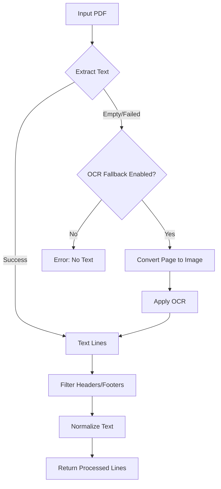

# PDF Extraction and Text Processing Pipeline

## Overview

The PDF extraction pipeline is responsible for converting PDF reports into structured text that can be processed by the parser. The pipeline includes fallback to OCR when necessary and handles multi-page documents with headers and footers.



## Components

### 1. PDF Text Extraction

Primary function: `extract_lines_from_pdf(path: str, cfg: Config) -> list[list[str]]`

This function:
- Opens the PDF file
- Extracts text from each page
- Returns a list of lists, where each inner list contains the lines from one page
- Handles OCR fallback if configured and needed

```python
def extract_lines_from_pdf(path: str, cfg: Config) -> list[list[str]]:
    """
    Extract text lines from each page of a PDF.
    
    Args:
        path: Path to the PDF file
        cfg: Application configuration
        
    Returns:
        List of lists, where each inner list contains lines from one page
    """
    lines_per_page = []
    
    # Use pdfplumber or PyMuPDF to extract text
    with pdf_open(path) as pdf:
        for page_num, page in enumerate(pdf.pages, 1):
            text = extract_text_from_page(page)
            
            # If text extraction failed and OCR fallback is enabled
            if (not text or text.isspace()) and cfg.input.ocr_fallback:
                text = apply_ocr_to_page(page, cfg.input.ocr_lang)
                
            # Split text into lines and clean
            page_lines = [line.strip() for line in text.split('\n') if line.strip()]
            lines_per_page.append(page_lines)
            
    return lines_per_page
```

### 2. OCR Fallback

Function: `apply_ocr_to_page(page, lang: str) -> str`

This function:
- Converts a PDF page to an image
- Applies OCR to extract text
- Returns the extracted text as a string

```python
def apply_ocr_to_page(page, lang: str) -> str:
    """
    Apply OCR to a PDF page.
    
    Args:
        page: PDF page object
        lang: OCR language
        
    Returns:
        Extracted text as a string
    """
    # Convert page to image using pdf2image
    image = convert_page_to_image(page)
    
    # Apply OCR using pytesseract
    text = pytesseract.image_to_string(image, lang=lang)
    
    return text
```

### 3. Text Preprocessing

Function: `preprocess_lines(lines_per_page: list[list[str]], cfg: Config) -> list[str]`

This function:
- Flattens the list of lines from all pages
- Filters out headers and footers
- Normalizes text (e.g., handling whitespace)
- Returns a single list of processed lines

```python
def preprocess_lines(lines_per_page: list[list[str]], cfg: Config) -> list[str]:
    """
    Preprocess text lines from all pages.
    
    Args:
        lines_per_page: List of lists, where each inner list contains lines from one page
        cfg: Application configuration
        
    Returns:
        Single list of processed lines
    """
    # Compile header/footer patterns
    header_patterns = [re.compile(pattern, re.IGNORECASE) for pattern in cfg.parsing.header_patterns]
    
    # Flatten and process lines
    processed_lines = []
    for page_lines in lines_per_page:
        for line in page_lines:
            # Skip headers and footers
            if any(pattern.search(line) for pattern in header_patterns):
                continue
                
            # Add line to processed lines
            processed_lines.append(line)
            
    return processed_lines
```

## Integration with Parser

The PDF extraction pipeline integrates with the parser as follows:

```python
def process_file(file_path: str, cfg: Config) -> list[Record]:
    """
    Process a single PDF file.
    
    Args:
        file_path: Path to the PDF file
        cfg: Application configuration
        
    Returns:
        List of parsed records
    """
    # Extract lines from PDF
    lines_per_page = extract_lines_from_pdf(file_path, cfg)
    
    # Preprocess lines
    processed_lines = preprocess_lines(lines_per_page, cfg)
    
    # Parse lines into records
    records = parse_lines(processed_lines, file_path, cfg)
    
    return records
```

## Performance Considerations

### Parallel Processing

If `cfg.performance.parallel_pages` is enabled, the PDF extraction can be parallelized:

```python
def extract_lines_from_pdf_parallel(path: str, cfg: Config) -> list[list[str]]:
    """
    Extract text lines from each page of a PDF in parallel.
    
    Args:
        path: Path to the PDF file
        cfg: Application configuration
        
    Returns:
        List of lists, where each inner list contains lines from one page
    """
    with pdf_open(path) as pdf:
        pages = list(pdf.pages)
        
    # Process pages in parallel
    with concurrent.futures.ThreadPoolExecutor() as executor:
        results = list(executor.map(
            lambda page: process_page(page, cfg),
            pages
        ))
        
    return results
```

### OCR Optimization

OCR is computationally expensive, so it's only applied when necessary:

1. Only apply OCR when text extraction fails
2. Only process pages that need OCR, not the entire document
3. Use appropriate resolution settings for OCR to balance speed and accuracy

## Error Handling

The pipeline includes robust error handling:

1. File not found or permission errors
2. PDF parsing errors
3. OCR failures
4. Memory constraints for large documents

Each error is logged and, where possible, the pipeline continues with partial results.

## Extensibility

The pipeline is designed to be extensible:

1. Support for different PDF libraries (pdfplumber, PyMuPDF)
2. Pluggable OCR engines
3. Customizable text preprocessing